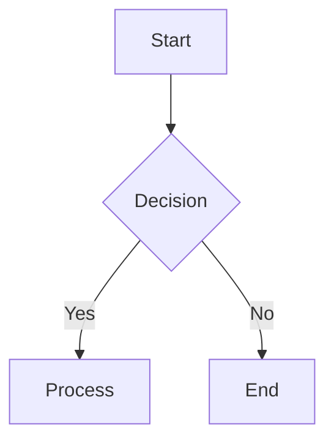
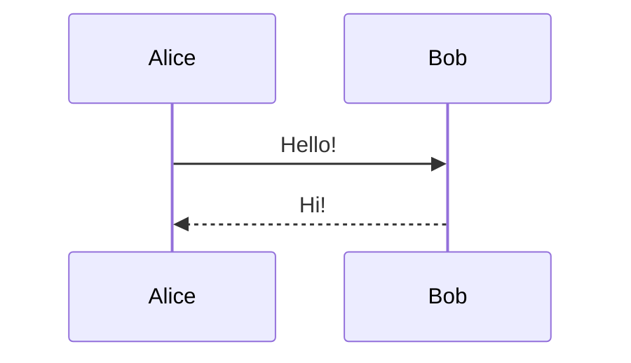
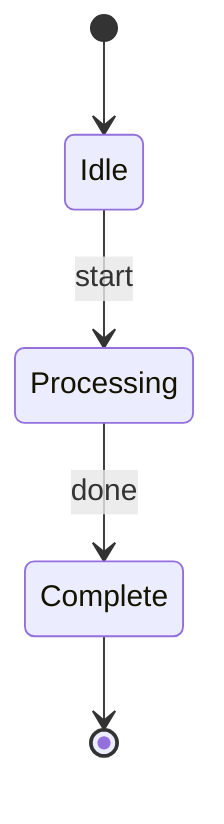

# Beautiful Mermaid Skill for Moltbot

Render Mermaid diagrams as beautiful SVGs or ASCII art directly in Moltbot.

## Overview

This skill integrates the [beautiful-mermaid](https://github.com/lukilabs/beautiful-mermaid) library into Moltbot, allowing you to:
- Generate professional SVG diagrams with 15+ built-in themes
- Create terminal-friendly ASCII art diagrams
- Support 5 diagram types: Flowcharts, State, Sequence, Class, and ER diagrams

## Features

- ✨ **Auto-installation** - Dependencies installed automatically on first use
- 🎨 **15 Themes** - Including Tokyo Night, Dracula, Catppuccin, Nord, and more
- 📊 **Dual Output** - SVG for rich UIs, ASCII for terminals
- ⚡ **Zero Config** - Works out of the box

## Installation

1. Copy the `beautiful-mermaid` folder to your Moltbot skills directory:
   ```bash
   cp -r beautiful-mermaid /path/to/your/clawd/skills/
   ```

2. The skill will auto-install `beautiful-mermaid` npm package on first use.

## Usage

### Generate SVG

```bash
# Render to SVG (default: tokyo-night theme)
echo 'graph TD; A --> B' | node scripts/render.js

# Use a different theme
echo 'graph TD; A --> B' | node scripts/render.js -t dracula

# List available themes
node scripts/render.js --list-themes
```

### Generate ASCII

```bash
# Render to ASCII art
echo 'graph TD; A --> B' | node scripts/render.js -f ascii
```

### Example Diagrams

**Flowchart**


**Sequence Diagram**


**State Diagram**


## Available Themes

| Theme | Type | Description |
|-------|------|-------------|
| `zinc-light` | Light | Clean light theme |
| `zinc-dark` | Dark | Clean dark theme |
| `tokyo-night` | Dark | Popular dark theme with blue accents (default) |
| `tokyo-night-storm` | Dark | Deeper Tokyo Night variant |
| `catppuccin-mocha` | Dark | Warm dark theme |
| `catppuccin-latte` | Light | Warm light theme |
| `nord` | Dark | Arctic-inspired dark theme |
| `dracula` | Dark | Classic dark theme |
| `github-light` | Light | GitHub-style light theme |
| `github-dark` | Dark | GitHub-style dark theme |
| `solarized-light` | Light | Solarized light theme |
| `solarized-dark` | Dark | Solarized dark theme |
| `one-dark` | Dark | Atom One Dark theme |

## CLI Options

```
-f, --format <svg|ascii>  Output format (default: svg)
-t, --theme <name>        Theme name (default: tokyo-night)
--bg <color>              Background color (hex)
--fg <color>              Foreground color (hex)
--transparent             Transparent background
--list-themes             Output available themes as JSON
```

## Custom Theming

Override theme colors:
```bash
node scripts/render.js --bg "#1a1b26" --fg "#a9b1d6" diagram.mmd
```

## Project Structure

```
beautiful-mermaid/
├── SKILL.md              # Skill documentation
├── README.md             # This file
└── scripts/
    ├── render.js         # Main render script with auto-install
    └── node_modules/     # Auto-installed dependencies
```

## Dependencies

- [beautiful-mermaid](https://www.npmjs.com/package/beautiful-mermaid) ^0.1.3
- Auto-installed on first run

## License

MIT - See [LICENSE](LICENSE) for details.

## Credits

- [beautiful-mermaid](https://github.com/lukilabs/beautiful-mermaid) by Craft
- ASCII rendering based on [mermaid-ascii](https://github.com/AlexanderGrooff/mermaid-ascii) by Alexander Grooff

## Contributing

Pull requests welcome! Please ensure:
- Code follows existing style
- Test your changes with multiple diagram types
- Update documentation as needed
